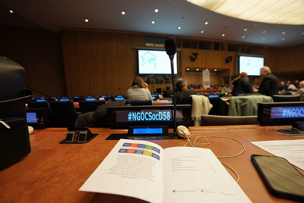

<section id="first" class="spotlights">
  <section>
    
    

      

        

          I had been to New York multiple times throughout my life - once in sixth grade, and the other in ninth. 
          In neither of those trips had I visited the United Nations Headquarters in person, 
          let alone walk into the barred gates through a pass.
        

        

          This trip was different. I left the Macy’s, Times Square, my dollar pizza parlor trips 
          (which, actually, happens to be one of my favorite activities) under the sunny weather behind. 
          It was unbeknownst to me that the chilly winds of a February could cut through my anorak like it was nothing. 
          As the wind howled around me, freezing my cheeks, I proudly presented my UN ground pass that read a big “N” in gold. 
          The man took one look at me - must have been the thousandth or so time that he saw one of those passes - 
          and I could almost hear him say, “I swear he’s a little too young.”
        

      

    

  </section>
  <section>
    
    

      

        

          As I passed the revolving gates, a flamboyant, promising banner read “58th Session of the Commission for Social Development”. My heart swelled. Although I arrived late due to schedule issues, and the commission was slowly coming to closing, it was exhilarating to know that I was in the presence of hundreds of experts, pundits, and government officials making a solemn stand against an issue that plagued every corner of the Earth: homelessness.
        

        

          Walking in, my eyes began to water as the glass panels of the looming UN headquarters reflected off bits of light from the cold, cloudless sky. Rays of sun bounced off the glassy surface of the river nearby. Out of pure nervousness, I clutched the straps of my bookbag tight. The Foundation for Preventing Youth Violence had awarded me the title of an ambassador for my contributions to the club; it was now time for me to prove that they were not mistaken in their choice.
        

      

    

  </section>
</section>

<section id="two" class="style2">
  

    

      

        It was the first night I spent at the Commission for Social Development. The day was coming to a close, and so were my eyes from the intense hours of listening to the numerous side meetings that ensued as soon as I got off the plane ride from Seoul. But as I stepped foot into the general meeting room, I felt my body slowly react to my surroundings, waking itself up as I began realizing the almost overwhelming presence of the figures in the room. Activists, those who had thrown themselves against homelessness and specific areas of it for years, if not decades, of their lives, were slowly filling up the seats. Up ahead were four panelists who were there to share their experiences with us. I was simultaneously intimidated and intrigued, knowing that I was in the presence of at least a century of dedication and sacrifices.
      

      

        The microphone above us slowly began crackling. And with it, the ambassadors from the FPYV and I began listening intently. I was especially intrigued by the story of the woman in the red skirt (get the name) who had overcome years of drug abuse and homelessness. Yet, I was also abhorred by the fact that so little had been done for those who were undergoing similar experiences, and that she was one of the extremely few that was lucky enough to come to a position she was in today.
      

    

  

</section>

	

		

		

		

	

<section id="three" class="style2">
  

    

      

        The most memorable event was the rounds of closing remarks given by the respectable delegates of each country on the last day of the event. There, I was truly able to witness the gravity of the situation, the solemn willingness, courage, and gentle tenacity of the representatives that gathered in one of the most important buildings on earth to set aside their diplomatic differences to take a step forward in eradicating homelessness.
      

      

        In truth, it had never occurred to me, a man living in an extremely privileged setting, that those heightened measures were being taken against homelessness. To me, it had just been a perpetual, ever existing, and expanding issue that governments simply weren't doing enough to. Perhaps that may be the case to some - that is a debate for another time. But in retrospect, to quickly judge the delegates and the work of the countries that they represented based on flimsy preconceptions and “facts” was extremely arrogant of me. Out of hubris, I had simply assumed that 1. Countries were not doing enough, and 2. Homelessness was not that grave of an issue. That changed when the delegate of Zimbabwe spoke. Just in the Sub-Saharan African region, 238 million people were living in, in his own words, “deplorable settlements”. Cultural divides, neglect, greed, forced eviction, and climate changes were beginning to start nipping at our soles at an incredibly alarming rate. It gave me hope to hear from the Delegate of India that large scale employment programs and health programs, which was actually the largest in the world, covered around 500 million people. More women were being employed, insurances becoming increasingly affordable, and 125 Billion USD was being poured into combatting this issue.
      

    

  

</section>

<section id="four" class="spotlights">
  <section>
    
    

      

        

          As delegates from Zimbabwe all the way to Korea, my heart rose and sank as the delegates rose and sank in and out of their seats. Their message was clear.  Humanity, all around the globe, was seriously starting to come face to face with this ever-growing dragon of a problem called homelessness. But at the same time, we were also starting to recognize it's dangers and pitch in some of our best efforts to combat it. After all, housing was one of the most primal, basic human needs that needed to be catered to.
        

        

          The 58th commission for social development ended like that, under some scattered applause and a sense of apprehension in the air for an uncertain future. But just like the issue of homelessness, some lessons stuck with me.
        

      

    

  </section>
  <section>
    
    

      

        

          Above is a picture from one of the more memorable side meetings that I attended. It should have taken place around the second day of my time there. As the title suggests, this particular session was held almost exclusively on women’s rights to affordable housing. My immediate reaction was to question. “What percent of all homeless people are actually female?” In the short 17 years of my life up to this meeting, I had never seen a homeless woman in person. But the reality was grimmer than I thought - homelessness did not discriminate. Although men were more likely to be homeless and destitute, women were not safe from poverty’s maw either. In fact, the women who were afflicted tended to be even less economically independent, and their biological disadvantage in strength compared to men made them easy targets of violence on the streets. But this side event didn't just burden me with feelings of sadness and anger - it reaffirmed the realization that homelessness was a beast that needed people from all walks of life to tackle it from multiple directions. No matter how big or small the numbers that certain activists would cater to, every ounce of effort would count.
        

      

    

  </section>
</section>

<section>
  

  

</section>

	

		

		

	

<section id="five" class="style2">
  

    

      

          These two pictures are taken from one of the first side events that I attended at the United Nations. While I was a little groggy from changing in the taxi from JFK to the UN Headquarters, the presentation left me shaken. Growing up under parents who specialized in the integration of technology with their field of study, economics, I was always told that technology would be the way to solve most problems in the future. In all honesty, however, I must say that I may have given less credit where it was due. I, personally, was a big believer in the sentiment that humans were needed to solve human problems, not technology. By the time this side event ended, I felt a surge of respect (and embarrassment) knowing that my parents were absolutely right. In certain countries like Japan, where the esteemed researchers had come from that day to give us a presentation, human resources were not necessarily readily available. In other words, they had no option but to turn to technology to search for a reliable source of caring - hence, the emphasis on the Internet of Things and the interconnectivity of cheap, affordable housing through the power of advanced technology. This meeting was especially chilling considering that Korea was following Japan’s footsteps. With our geriatric population ever-growing, while our birthrates ever-dropping, I began to understand that this technological approach to providing affordable and safe housing to most people could be our reality one day.
        

        

          It was a pleasant surprise knowing that there were experts in the field of combatting homelessness who were genuinely passionate about their cause. One particular meeting especially emphasized this for me. As the ambassador of the Foundation for Preventing Youth Violence, I was itching to ask a question about problems such as violence towards homeless children compared to those who had stable housing which would give the organization more insight into possible looking into the issue of homelessness or poverty in Korea as well. Yet, it seemed almost impossible to get an opportunity to present my question. One such moment was when a woman from an independent homeless charity organization based in New York (*this may have been Florida, must confirm with Dustin*) began giving what almost seemed like a speech to the room. She was a strong, confident woman who explained to us that in essence, they were lacking in funds, the homeless left uncatered to, and hence at always at risk of having to give up providing care to some people at the end of the day. Initially, as she began speaking minutes and minutes overtime, I was getting scared and perhaps a little impatient that I would not be able to gain an insight into my question. Yet, as I began to hear her plea for help and advice, it dawned on me that we were all there to solve an issue of our own. And when it came to homelessness, the issue of lack of awareness (or willful neglect) and funds seemed to be a recurring problem, developed and developing countries alike. I began reflecting on my countries, Singapore, the US, and Korea, pondering on whether or not our societies were doing enough - if I had done enough. As her speech came to her closing remarks, and the panelists began giving out sincere advice and answers, I was moved to see with my own eyes that people with that much compassion, sincerity, and dedication still existed in this world. Harshly berating myself for my annoyance in the face of a noble cause and an urgent concern, I meekly raised my question to the panelists. I caught the woman listening to my question intently through the corner of my eye.
        

    

  

</section>

<section id="six" class="spotlights">
  <section>
    
    

      

        <header class="major">
					<h3>“... because SOCIETY is DEAD”</h3>
				</header>
      

    

  </section>
</section>

<section id="seven" class="style2">
  

    

      

        The anguished voice of the lone Indian man standing up in the grand conference room tore through my ears. I learned two things that day: first, the earpieces at the United Nations had a volume function that I could use to turn the volume down - that was a harsh lesson. But secondly, that not everyone was (or felt the need to be) compassionate towards one’s anger. He had spoken those last four words loudly and clearly in response to the question as to why despite the effort of his people and the government, homelessness simply did not decrease. The moment that phrase rang through the hall, some people began sniggering and whispering snidely about his accent and untimely outburst of anger. The dynamics of the conference room carried them all the way back to my seat, causing me to twitch and shift uncomfortably in my chair. The man carried on, continuously blaming society for its neglect and heartlessness until the chair politely silenced him, thanking him for his passion and service. Again, whispering and some sniggering about him being a pointless, inconducive cynic. In retrospect, it most likely is true that he did not contribute much to the experts in the room - years of research and service should have made them aware that neglect and stigmas are perhaps the leading cause of the persistence of homelessness. To me, however, this moment signified something else. The lack of compassion, and if I may daresay, arrogance, and neglect towards a man’s sincere cries coming from the bottom of his heart took me aback by a little. This was the United Nations, a place where people were to set aside their differences to fight towards a common goal. That day, I learned an important lesson about human nature as well as the nature of cooperation: it never has been, and it never will be always a glamorous thing. Hubris, arrogance, overzealousness - all these things seemed to contribute to cracks in cooperation between people. Yet, it relieved me to see people shaking his hand as the committee began leaving the room, thanking him for his speech. Truly multifaceted and complex, society was.
      

    

  

</section>
 

	

		

		

		

	

<section id="eight" class="style2">
  

    

      

        In the short intermissions between general committee sessions and side meetings, I was given the privilege of roaming (almost) free within the United Nations headquarters. As an avid Model United Nations delegate and chair, the Security Council was always of great interest to me. It was unfortunately closed to anyone under a delegate pass, however. That never stopped me from wandering around room to room and reveling at the elegant, all-encompassing design of the United Nations. Each conference room seemed to have its own characteristics. For example, one conference room had a conical shape that pointed upwards. This room was especially memorable as for some reason, the seat of the chair seemed to have a gravity of its own, beckoning me to step closer and closer until I caught myself coming close to inching a little too further than my pass allowed. Another memorable conference room was filled with bright colors and what seemed to be a girl clutching onto a goose or a dove.
      

    

  

</section>

	

		

		

		

	

<section id="nine" class="style2">
  

    

      

        Even the hallways and windowpanes of the United Nations, in fact, seemed to say something special about them. On every floor of the headquarters were giant, imposing murals that each said something different about humanity. Although I'm no art buff, the sheer might of the murals that spoke of progress, culture, peace, and war was enough to silence me. I stood in front of them, admiring them for minutes, a million thoughts running through my head. As I was pondering on the beauty of the multifacetedness of man, on our ability to imagine, create, destroy, nurture, and learn, I was reminded that another side meeting of interest was about to occur.
      

      

        Along the way, I passed a massive window that captured the skyline of New York City. The sunbeams bounced off the East River, blinding my eyes. I took in a deep breath, asked for a picture to cherish the moment later on, then continued to walk.
      

    

  

</section>

	

		

		

		

	

<section id="ten" class="style2">
  

    

      

        Throughout the side events, I had been extremely active (more active than the other ambassadors sent from the FPYV, if I may daresay). I asked question after question, staying back and trying to understand viewpoints I agreed with as well as those I clashed with. But whether I, with the puny knowledge and confidence of a somewhat well-researched teenager, initially agreed or disagreed with the presenters in side meetings, did not matter. In every nook and cranny of the side meetings was room for development. After all, I was speaking to experts who had devoted months, if not entire years of their lives to alleviate the pain caused by a single issue in their own way. Through the experience of thorough questioning, discussion, and clarification, I was able to learn humility and respect.
      

      

        In essence, I was given the opportunity to set foot into the workspace of those who were actively taking a stand against an issue that has plagued our society since the idea of sedentary living came to be. And if I’m being honest, the two largest feelings that penetrated my heart was the feeling of powerlessness and respect. The efforts, at times, almost seemed dwarfed compared to the rate that homelessness was claiming lives from its victims, enough to make me question briefly - “is this really worth it? What can anyone do about this?”. It was not an issue that applied to the majority of people inhabiting the Earth, certainly not enough to make the governments around the world prioritize the eradication of homelessness. Still, it was a number large enough that nobody could ignore - yet support for those fighting against it was more often than not insufficient. The ordeal reminded me of the Korean adage: “as hopeless as pouring water into the bottom of an empty jug”.
      

      

        But was it really hopeless? By attending the side meetings, I learned that hordes of motivated intellectuals were clamoring to find their own ways to combat different branches of the deep-rooted issue. It gave me a sense of respect knowing that these people gathered there on that day were not sinking into the defeatist mindset in the face of such a large evil, and hence their “small” actions could completely alter the course of at least one person that they were tending to. Most importantly, it gave me the courage and confidence that I was able to do the same within my organization. Compared to the issue of youth violence, I was naught but one person, and even the organization itself was naught but one small group of people with a common goal in mind. Even so, the days I spent at the 58th Commission for Social Development taught me an invaluable lesson.
      

    

  

</section>

<section id="closing" class="spotlights">
  <section>
    
    

      

        <header class="major">
					<h3>
            In the end, it was always the small people throwing everything they can at whatever issue needed conquering, that was the extra straw on the camel's back that could ultimately motivate larger and larger populaces to join them in their cause.
          </h3>
				</header>
      

    

  </section>
</section>

<section id="misc-title">
	

		<header class="major">
			<h4>Photos</h4>
		</header>
	

</section>

	

		

    

		

		<!-- Break -->
    

		

		

	

