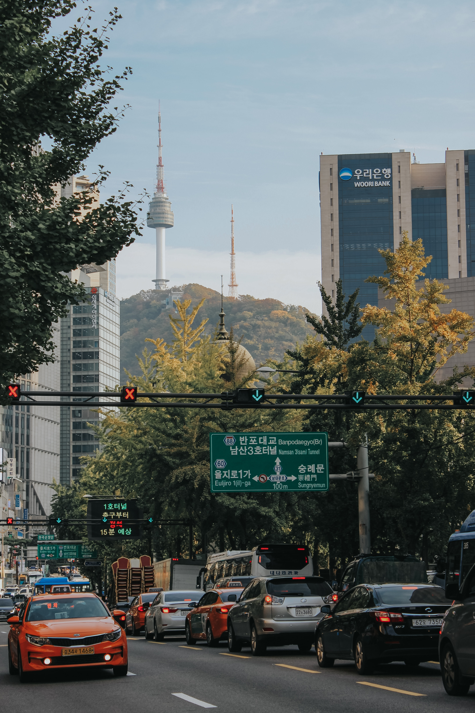

<!-- Countries -->
<section id="countries">
	

		<header class="major">
			<h3>Articles by Country</h3>
		</header>
	

  

    

      

        

          
          

            
NYC

          

        

      

      

        

          
          

            
Seoul

          

        

      

      

        

          
          

            
Singapore

          

        

      

      

        

          
          

            
Honolulu

          

        

      

    

  

  

</section>